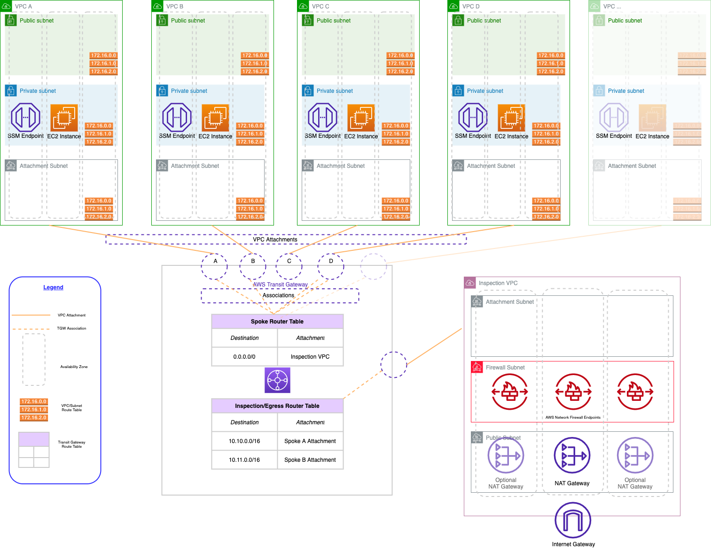

# AWS Hub and Spoke Architecture with an Inspection VPC - AWS CDK Sample Code

This repository contains CDK code to deploy a sample AWS Hub and Spoke architecture with an Inspection VPC using AWS Network Firewall. The repo will also use an AWS CDK CI/CD Pipeline to deploy and manage each resource. The resources deployed and the architectural pattern they follow are purely for demonstration/testing purposes.

------

## Prerequisites

- An AWS account with an IAM user with the appropriate permissions
- Familar with an IDE or other text editiging sofware to view and edit the repo files

## Code Principles

- Writing DRY (Do No Repeat Yourself) code using a modular design pattern

## Usage

- Clone the repository
- The repository has seperate folders for each CDK language.

**Note** EC2 instances, VPC endpoints, and  AWS Network Firewall endpoints will be deployed in all the Availability  Zones configured for each VPC. Keep this in mind when testing this  environment from a cost perspective - for production environments, we  recommend the use of at least 2 AZs for high-availability.

## Target Architecture

## Deployment

The end architecture is deployed using CDK Pipelines. As such, the first 'cdk deploy' will:

- Create a Code Commit repository
- Create a Code Pipeline with the necessary role and permissions

The CDK Pipeline is a self mutating pipeline, which means it has the ability to 'update itself' when new stages are added to the CDK code.

This README will cover specifics for:

- Python
- TypeScript 
- Golang

## CDK Initial Setup

After cloning this repo, the region(s) being deployed to need to be bootstrapped:

cdk bootstrap the AWS region:

`cdk bootstrap aws://<account number>/<region>`

#### Enironment Variables 

Add account numbers in:

- Python: `cdk_pipelines/configurations.py`
- TypeScript: `cdkPipelines/lib/configurations.ts`
- Golang: `cdkPipelines/configurations.go`

Add the account number to the HUB_ACCOUNT_ID variable i.e. 

`HUB_ACCOUNT_ID = "123456789000"`

- cdk deploy (Deploy the 'NetworkPipeline')

### Python Specific

Create and 'activate' a virtual environment:

- `python3 -m venv .venv`
- `source ./.venv/bin/activate`

Install the required python libraries using pip

- `pip install -r requirements.txt`

### TypeScript Specific

Ensure the required Node.js packages are installed:

- `npm install`

#### How to destroy

To remove all the deployed resources:

Run `cdk destroy --all`

To ensure all the created CloudFormaton stacks are removed, use the AWS Console to log into the region this example was deployed, browse to CloudFormation and delete any left over Stacks specific to this example deployment.

### Stacks to remove:

- DeployInspection-Workload
- DeployInspection-Inspection
- DeployInspection-Workload2
- DeployInspection-TransitGateway

To remove all the CloudFormation Stacks using the AWS CLI, both the AWS CLI and jq need to be installed.

- `export REGION = <region being used> i.e. export REGION="eu-west-1"`
- `aws cloudformation list-stacks --region $REGION | jq '.StackSummaries[] | select ((.StackStatus == "CREATE_COMPLETE") or .StackStatus == "DELETE_FAILED") | select(.StackName | startswith("DeployInspection")) | .StackName' | xargs -I {} aws cloudformation delete-stack --stack-name {} --region $REGION`

This should delete the CloudFormation Stacks, however as the Inspection Stack will take longer than the Workloads Stacks and the TransitGateway Stack depends on the Workload and Inspection Stacks being deleted:

- Check for any remaining stacks

  - `aws cloudformation list-stacks --region $REGION | jq '.StackSummaries[] | select ((.StackStatus == "CREATE_COMPLETE") or .StackStatus == "DELETE_FAILED") | select(.StackName | startswith("DeployInspection")) | .StackName'`

- If any Stacks from this project remain, re-run the delete:

  - `aws cloudformation list-stacks --region $REGION | jq '.StackSummaries[] | select ((.StackStatus == "CREATE_COMPLETE") or .StackStatus == "DELETE_FAILED") | select(.StackName | startswith("DeployInspection")) | .StackName' | xargs -I {} aws cloudformation delete-stack --stack-name {} --region $REGION`

  

### CodeCommit

The CodeCommit repository name is hardcoded in the CDK code so it's a known repository name (network-pipeline-repo). To get this through the AWS CLI:

aws codecommit list-repositories --region <region> --query 'repositories[*].repositoryName'

** Note **

You will see an error in CodePipline similar to:

`The action failed because no branch named main was  found in the selected AWS CodeCommit repository network-pipeline-repo.  Make sure you are using the correct branch name, and then try again.  Error: null`

This is becuase the pipeline can't execute the code in the repo as it's not yet been pushed to the remote repo.

### Setting up CodeCommit repository

- git config --global credential.helper '!aws codecommit credential-helper $@'
- git config --global credential.UseHttpPath true
- git add .
- git commit -m "Initial commit"
- git remote add codecommit repository-url
- git checkout -mb main
- git push codecommit main

This will push the local code repository to the CodeCommit repository which the CodePipeline uses to deploy.

After a sucessful git push, CodePipeline will act on the CodeCommit update and go through the pipeline stages using CDK to build and deploy the resultant architecture.

### AWS Network Firewall Policy

The AWS Network Firewall Policy is defined in the locally:

- Python: `cdk_pipelines/firewall_rules.py`
- TypeScript: `cdkPipelines/lib/firewallRules.ts`
- Golang: `cdkPipelines/firewallRules.go`

 

#### Logging Configuration

This project configures both the alert and flow logs to  respective AWS Cloudwatch Log Groups (both for the VPC Flow logs and AWS Network Firewall logs). In VPC Flow logs, you can also use Amazon S3.  In Network Firewall, you can also use Amazon S3, or Amazon Kinesis  Firehose.

## Contributing

See [CONTRIBUTING](./CONTRIBUTING.md) for more information.

## Code of Conduct

See [CODE_OF_CONDUCT](./CODE_OF_CONDUCT.md) for more information.

## License

This library is licensed under the MIT-0 License. See the [LICENSE](/LICENSE.md) file.
